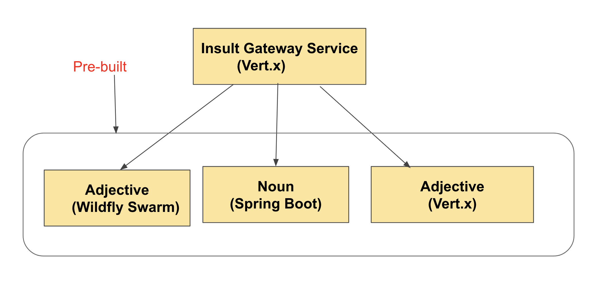

= Lab 03 : Our first Endpoint - Vertx Adjective Gateway Rest Service
:source-highlighter: coderay

== Use case - Elizabethan Insults ( Polyglot)
William Shakespeare is known as one of the most influental English writers, having introduced nearly 3000 words to the language. Fact: Elizabethan Language and Vocabulary differe from many of the words in the modern English language that we use today

http://www.elizabethan-era.org.uk/elizabethan-language.htm

We will be creating a Elizabethan insult service based on vert.x which calls others services noun,adjectives. Here is the high level diagram

==  Noun Service: 
This service is implemented using Spring Boot. Noun service returns a random elizabethan noun, reading the nouns from the file. If you would like to refer the code, here is the code. This service is already running on openshift as a common service for all the lab paticipants

https://github.com/rmaddali/springboot-noun-service

== Adjective Service (Wildfly Swarm): 
This service is implemented using Wildfly Swarm(Thorntail). Adjective service returns a random elizabethan adjective, reading the adjective from the file. If you would like to refer the code, here is the code. This service is already running on openshift as a common service for all the lab paticipants

https://github.com/rmaddali/wildflyswarm-adj

== Adjective Service (Vert.x): 
This service is another adjective service implemented using Vert.x. Adjective service returns a random elizabethan adjective, reading the adjective from the file. If you would like to refer the code, here is the code. This service is already running on openshift as a common service for all the lab paticipants

https://github.com/rmaddali/vertx-adjective-service

== Insult Gateway Service - Using Multiple Verticles

In this lab and coming labs we will be implementing Insult Service as a gateway that access all the 3 services(noun, adjective,adjective) and return an aggregrated json object.

=== Test First!

Let's update our MainVerticleTest to check for an insult:

Modify src/test/java/io/vertx/starter/MainVerticleTest.java so that it also checks for an insult:

[source,java]
....

package io.vertx.starter;

import io.vertx.core.Vertx;
import io.vertx.ext.unit.Async;
import io.vertx.ext.unit.TestContext;
import io.vertx.ext.unit.junit.VertxUnitRunner;
import org.junit.After;
import org.junit.Before;
import org.junit.Test;
import org.junit.runner.RunWith;

@RunWith(VertxUnitRunner.class)
public class MainVerticleTest {

  private Vertx vertx;

  @Before
  public void setUp(TestContext tc) {
    vertx = Vertx.vertx();
    vertx.deployVerticle(MainVerticle.class.getName(), tc.asyncAssertSuccess());
  }

  @After
  public void tearDown(TestContext tc) {
    vertx.close(tc.asyncAssertSuccess());
  }

  @Test
  public void testThatTheServerIsStarted(TestContext tc) {
    Async async = tc.async();
    vertx.createHttpClient().getNow(8080, "localhost", "/", response -> {
      tc.assertEquals(response.statusCode(), 200);
      response.bodyHandler(body -> {
        tc.assertTrue(body.length() > 0);
        tc.assertTrue(body.toString().equalsIgnoreCase("Hello, Vert.x Insult Gateway!"));
        async.complete();
      });
    });
  }

  @Test
  public void testThatTheServerIsServingInsults(TestContext tc) {  //          <1>
    Async async = tc.async();
    vertx.createHttpClient().getNow(8080, "localhost", "/api/insult", response -> {
      tc.assertEquals(response.statusCode(), 200);
      response.bodyHandler(body -> {
        tc.assertTrue(body.length() > 0);
        tc.assertTrue(body.toString().equalsIgnoreCase("Hi, inebrious, sheep-biting foot-licker!"));
        async.complete();
      });
    });
  }
}

....

<1>  Check for our hard-coded insult

Run the test.  It should fail.  Red, green, refactor...

[code,bash]
....

mvn clean test
...

Failed tests:   testThatTheServerIsServingInsults(io.vertx.starter.MainVerticleTest): Not equals : 404 != 200

Tests run: 2, Failures: 1, Errors: 0, Skipped: 0

[INFO] ------------------------------------------------------------------------
[INFO] BUILD FAILURE
[INFO] ------------------------------------------------------------------------
[INFO] Total time: 2.466 s
[INFO] Finished at: 2018-10-10T16:17:31-04:00
[INFO] Final Memory: 21M/307M
[INFO] ------------------------------------------------------------------------

....

=== Insult Service Rest Endpoint

Now we will build a Verticle to serve insults (and pass the test.)

An important note to remember is that a Verticle is a unit of deployment. It allows you to encapsulate your code for different needs. In addition, Verticles can be run independently of each other. Verticles communicate with each other by sending messages on an event bus that is a core part of Vert.x. For this example, we have developed two Verticles. One is the sender and the other is the receiver. 

Lets create a new verticle class for exposing a new get rest endpoint at '/api/insult'. 

=== src/main/java/io/vertx/starter/InsultGatewayVerticle.java 

[code,java]
....

package io.vertx.starter;

import io.vertx.core.Future;
import io.vertx.reactivex.core.AbstractVerticle;
import io.vertx.reactivex.core.http.HttpServerResponse;
import io.vertx.reactivex.ext.web.Router;
import io.vertx.reactivex.ext.web.RoutingContext;
import io.vertx.reactivex.ext.web.handler.StaticHandler;
import org.slf4j.Logger;
import org.slf4j.LoggerFactory;

public class InsultGatewayVerticle extends AbstractVerticle{

	private static final Logger LOG = LoggerFactory.getLogger(InsultGatewayVerticle.class);
	
	@Override
        public void start(Future<Void> startFuture) {
		
	    Router router = Router.router(vertx);
	    vertx.createHttpServer().requestHandler(router::accept).listen(8080);
	    router.get("/").handler(this::indexHandler);  //          <1>
	    router.get("/api/insult").handler(this::insultHandler);  //          <2>
	    
	    startFuture.complete();
	 }
	
	private void indexHandler(RoutingContext routingContext) {

	  HttpServerResponse response = routingContext.response(); 
	  response
	    .putHeader("Content-Type", "text/html")                
	    .end("Hello, Vert.x Insult Gateway!");                                

	}

	private void insultHandler(RoutingContext routingContext) {

	  HttpServerResponse response = routingContext.response(); 
	  response
	    .putHeader("Content-Type", "text/html")                
	    .end("Hi, inebrious, sheep-biting foot-licker!");                                

	}
		
}

....

Most of the code in the above class is covered in the previous labs except:

1. This is our previous handler returning, "Hello, Vert.x Insult Gateway!"
2. This is a new handler to serve insults

=== Modify src/main/java/io/vertx/starter/MainVerticle.java 

Remove most of the functionality from MainVerticle.  Its' only task now is to instantiate the InsultGatewayVerticle.

[code,java]
....

package io.vertx.starter;

import io.vertx.core.Future;
import io.vertx.reactivex.core.AbstractVerticle;

public class MainVerticle extends AbstractVerticle {

  @Override
  public void start(Future<Void> startFuture) {
	  
    vertx.deployVerticle(InsultGatewayVerticle.class.getName());  //          <1>
		 
    startFuture.complete();
  }
	
}

....

1. deploy new verticle class that we created which is exposing the actual endpoint

=== Package the app  

[source,shell]
....

mvn clean package

....

Run the following command. It should pass

[source,shell]
....

mvn clean test

[INFO] Including com.fasterxml.jackson.core:jackson-annotations:jar:2.9.5 in the shaded jar.
[INFO] Including io.vertx:vertx-rx-java2:jar:3.5.2 in the shaded jar.
[INFO] Including io.reactivex.rxjava2:rxjava:jar:2.1.9 in the shaded jar.
[INFO] Including org.reactivestreams:reactive-streams:jar:1.0.2 in the shaded jar.
[INFO] Including io.vertx:vertx-web:jar:3.5.2 in the shaded jar.
[INFO] Including io.vertx:vertx-auth-common:jar:3.5.2 in the shaded jar.
[INFO] Including io.vertx:vertx-bridge-common:jar:3.5.2 in the shaded jar.
[INFO] Including org.slf4j:slf4j-api:jar:1.7.25 in the shaded jar.
[INFO] Including org.slf4j:slf4j-simple:jar:1.7.25 in the shaded jar.
[INFO] Including org.apache.logging.log4j:log4j-api:jar:2.11.1 in the shaded jar.
[INFO] Including org.apache.logging.log4j:log4j-core:jar:2.11.1 in the shaded jar.
[INFO] ------------------------------------------------------------------------
[INFO] BUILD SUCCESS
[INFO] ------------------------------------------------------------------------
[INFO] Total time: 4.504 s
[INFO] Finished at: 2018-10-08T01:40:54-04:00
[INFO] ------------------------------------------------------------------------

...
   
Continue to Lab 4 ->  https://github.com/rhte-reactive-labs/reactive-pipelines/blob/master/labs/lab04-ExternalizeConfig.adoc
