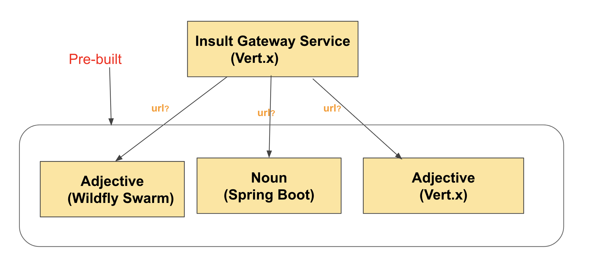

= Lab 04 : Externalize Configuration

:source-highlighter: coderay

== Service locations

Our InsultGatewayService  has to known the location(url) of the other 3 rest services (noun, adjective, adjective). Rather than hardcoding the urls, we will create a config file to retrive the urls.

=== Vertx Config
Vert.x Config provide an extensible way to configure Vert.x applications:

retrieve configuration from anywhere (file, directory, HTTP location, Git repository, Zookeeper…​)

write your configuration in any format (properties, json, yaml, hocon…​)

== Configuration file
We will keep our environment specific configuration in a json file. lets create the following json file

=== Create src/main/resources/insult-config.json
[code,json]
----
{
	"env": "local",
	"insults.address": "insults-address",
	"db.url": "jdbc:hsqldb:mem:testdb;shutdown=true",
	"db.driver": "org.hsqldb.jdbcDriver",
	"db.user": "sa",
	"db.password": "sa",
	"query.all-insults": "SELECT * FROM INSULTS",
	"gateway.circuit-timeout": 1000,
	"gateway.reset-timeout": 1000,
	"gateway.host.springboot.noun": "thorntail-rest-http-thorntail-noun.b9ad.pro-us-east-1.openshiftapps.com", [1]
	"gateway.host.springboot.noun.port": 80,
	"gateway.host.wildfly-swarm.adj": "spring-boot-rest-http-springboot-adj.b9ad.pro-us-east-1.openshiftapps.com",[2]
	"gateway.host.wildfly-swarm.adj.port": 80,
	"gateway.host.vertx.adj": "spring-boot-rest-http-springboot-adj.b9ad.pro-us-east-1.openshiftapps.com", [3]
	"gateway.host.vertx.adj.port": 80
}
----
1. external adjective service running on ocp cluster
2. external noun service running on ocp cluster
3. external adjective service using spring boot on ocp cluster
 

=== Edit src/main/java/io/vertx/starter/MainVerticle.java 

[code,java]
....
package io.vertx.starter;

import io.vertx.core.Future;
import io.vertx.reactivex.core.AbstractVerticle;
import io.reactivex.Maybe;
import io.vertx.core.json.JsonObject;
import io.vertx.config.ConfigStoreOptions;
import io.vertx.config.ConfigRetrieverOptions;
import io.vertx.reactivex.config.ConfigRetriever;
import io.vertx.core.DeploymentOptions;

public class MainVerticle extends AbstractVerticle {

	 @Override
	  public void start(Future<Void> startFuture) {
	  
	  
		 initConfigRetriever() <1>
	      .doOnError(startFuture::fail)
	      .subscribe(ar -> {
	        vertx.deployVerticle(InsultGatewayVerticle.class.getName(), new DeploymentOptions().setConfig(ar)); <2>
	       
//	        vertx.deployVerticle(ConfigTestVerticle.class.getName(), new DeploymentOptions().setConfig(ar));
	        startFuture.complete();
	      });
  }
	 
	 Maybe<JsonObject> initConfigRetriever() {

		    // Load the default configuration from the classpath
		    //LOG.info("Configuration store loading.");
		    ConfigStoreOptions localConfig = new ConfigStoreOptions() <3>
		      .setType("file")
		      .setFormat("json")
		      .setConfig(new JsonObject().put("path", "insult-config.json"));

		    // When running inside of Kubernetes, configure the application to also load
		    // from a ConfigMap. This config is ONLY loaded when running inside of
		    // Kubernetes or OpenShift
		/*
		    ConfigStoreOptions confOpts = new ConfigStoreOptions()
		      .setType("configmap")
		      .setFormat("yaml")
		      .setConfig(new JsonObject()
		        .put("name", "app-config")
		        .put("optional", true)
		      );
		*/

		    // Add the default and container config options into the ConfigRetriever
		    ConfigRetrieverOptions retrieverOptions = new ConfigRetrieverOptions()
		      .addStore(localConfig);
//		      .addStore(confOpts);

		    // Create the ConfigRetriever and return the Maybe when complete
		    return ConfigRetriever.create(vertx, retrieverOptions).rxGetConfig().toMaybe(); <4>
		  }
}

1. Call new config retriver method to load the config file
2. Once the config file is loaded successfully, callback handler would deploy the InsultServiceGateway
3. Load the config file 
4. To retrieve the configuration the verticle needs a ConfigRetriever. This object allows retrieving configuration chunks from different stores (such as git, files, http, etc.). Here we just load the contents of the insult-config.json file located in the src/main/resources directory. The configuration is a JsonObject. Vert.x uses JSON heavily, so you are going to see a lot of JSON 

....

=== Edit src/main/java/io/vertx/starter/InsultGatewayVerticle.java 

[code,java]
....

package io.vertx.starter;

import io.vertx.core.Future;
import io.vertx.core.AsyncResult;
import io.vertx.reactivex.core.AbstractVerticle;
import io.vertx.reactivex.core.http.HttpServerResponse;
import io.vertx.reactivex.ext.web.Router;
import io.vertx.reactivex.ext.web.RoutingContext;
import io.vertx.reactivex.ext.web.handler.StaticHandler;
import io.vertx.reactivex.config.ConfigRetriever;
import io.vertx.reactivex.ext.web.client.WebClient;
import io.vertx.ext.web.client.WebClientOptions;
import io.vertx.core.json.JsonObject;
import io.vertx.reactivex.ext.web.client.HttpResponse;
import org.slf4j.Logger;
import org.slf4j.LoggerFactory;
import io.vertx.core.json.JsonArray;
import io.vertx.core.CompositeFuture;
import static io.vertx.starter.ApplicationProperties.*;

public class InsultGatewayVerticle extends AbstractVerticle{
	private static final Logger LOG = LoggerFactory.getLogger(InsultGatewayVerticle.class);
	
	private WebClient clientSpringboot;
    private WebClient clientSwarm;
    private WebClient clientVertx;
    private ConfigRetriever conf;
	
	@Override
	  public void start(Future<Void> startFuture) {
		
		conf = ConfigRetriever.create(vertx);
		Router router = Router.router(vertx);
		
	    
	    
	    clientSpringboot = WebClient.create(vertx, new WebClientOptions()
	    	      .setDefaultHost(config().getString(GATEWAY_HOST_SPRINGBOOT_NOUN, "springboot-noun-service.vertx-adjective.svc")) <1>
	    	      .setDefaultPort(config().getInteger(GATEWAY_HOST_SPRINGBOOT_NOUN_PORT, 8080)));

	    	    clientSwarm = WebClient.create(vertx, new WebClientOptions()
	    	      .setDefaultHost(config().getString(GATEWAY_HOST_WILDFLYSWARM_ADJ, "wildflyswarm-adj.vertx-adjective.svc"))
	    	      .setDefaultPort(config().getInteger(GATEWAY_HOST_WILDFLYSWARM_ADJ_PORT, 8080))); <2>

	    
	    
	    	    clientVertx = WebClient.create(vertx, new WebClientOptions()
	    	            .setDefaultHost("spring-boot-rest-http-springboot-adj.b9ad.pro-us-east-1.openshiftapps.com")
	    	            .setDefaultPort(80)); <3>
	    
	    	    vertx.createHttpServer().requestHandler(router::accept).listen(8080);
	    	    router.get("/api/insult").handler(this::insultHandler);
	    	    router.get("/*").handler(StaticHandler.create());
	    
	    
	    startFuture.complete();

	}
	Future<JsonObject> getNoun() {    <4>
        Future<JsonObject> fut = Future.future();
        clientSpringboot.get("/api/noun")
                .timeout(3000)
                .rxSend()  <5>

                .map(HttpResponse::bodyAsJsonObject) <6>
                .doOnError(fut::fail)
                .subscribe(fut::complete);    
        return fut;
    }

	Future<JsonObject> getAdjective() {
        Future<JsonObject> fut = Future.future();
        clientSwarm.get("/api/adjective")
                .timeout(3000)
                .rxSend()

                .map(HttpResponse::bodyAsJsonObject)
                .doOnError(fut::fail)
                .subscribe(fut::complete);
        return fut;
    }
	Future<JsonObject> getAdjective2() {
        Future<JsonObject> fut = Future.future();
        clientVertx.get("/api/adjective")
                .timeout(3000)
                .rxSend()

                .map(HttpResponse::bodyAsJsonObject)
                .doOnError(fut::fail)
                .subscribe(fut::complete);
        return fut;
    }
	private AsyncResult<JsonObject> buildInsult(CompositeFuture cf) { <7>
        JsonObject insult = new JsonObject();
        JsonArray adjectives = new JsonArray();

        // Because there is no garanteed order of the returned futures, we need to parse the results

        for (int i=0; i<=cf.size()-1; i++) {
        	 JsonObject item = cf.resultAt(i);
             if (item.containsKey("adjective")) {
                 adjectives.add(item.getString("adjective"));
             } else {
                 insult.put("noun", item.getString("noun"));
             }

        }
        insult.put("adjectives", adjectives);

        return Future.succeededFuture(insult);
    }
	private void insultHandler(RoutingContext rc) {
		
		CompositeFuture.all(getNoun(), getAdjective(), getAdjective2()) <8>
        .setHandler(ar -> {

        	if (ar.succeeded()) {
        		AsyncResult<JsonObject> result=buildInsult(ar.result());
        		 rc.response().putHeader("content-type", "application/json").end(result.result().encodePrettily());
        	}
        	else
        	{
        		System.out.println("error");

        		rc.response().putHeader("content-type", "application/json").end(new JsonObject("Error").encodePrettily());
        	}

          });                               
	  }
		
	}

....

1. The Web Client makes easy to do HTTP request/response interactions with a web server, and provides advanced features like:

	Json body encoding / decoding

	request/response pumping

	request parameters

	unified error handling

	form submissions

the WebClient is an asynchronous Vert.x HTTP client. 

2.  webclient  WildflySearm adj service 

3.webclient  Vertx adj service 
4. Method to call the actual noun service 
5. send request
6. map httpresponse to json object 
7. Composite object containing all the response objects from 3 services. transform the object to more of representation we want to show
8. concurrent composition of all 3 services .

=== Add pom.xml 

[code,xml]
....

<dependency>              
      <groupId>io.vertx</groupId>
      <artifactId>vertx-config</artifactId>      <1>
</dependency>
<dependency> 
      <groupId>io.vertx</groupId>
      <artifactId>vertx-web-client</artifactId>             <2>
 </dependency>

....

1. Above modules are pretty self explanatory and are needed for this lab.

=== Edit src/test/java/io/vertx/starter/MainVerticleTest.java 

[source,shell]
----
package io.vertx.starter;

import io.vertx.config.ConfigStoreOptions;
import io.vertx.core.DeploymentOptions;
import io.vertx.core.Vertx;
import io.vertx.core.json.JsonObject;
import io.vertx.ext.unit.Async;
import io.vertx.ext.unit.TestContext;
import io.vertx.ext.unit.junit.VertxUnitRunner;
import org.junit.After;
import org.junit.Before;
import org.junit.Test;
import org.junit.runner.RunWith;

@RunWith(VertxUnitRunner.class)
public class MainVerticleTest {

  private Vertx vertx;

  @Before
  public void setUp(TestContext tc) {
    vertx = Vertx.vertx();
    
    JsonObject localConfig=new JsonObject();
    localConfig.put("gateway.host.springboot.noun", "thorntail-rest-http-thorntail-noun.b9ad.pro-us-east-1.openshiftapps.com");
    localConfig.put("gateway.host.springboot.noun.port", 80);
    localConfig.put("gateway.host.wildfly-swarm.adj", "spring-boot-rest-http-springboot-adj.b9ad.pro-us-east-1.openshiftapps.com");
    localConfig.put("gateway.host.wildfly-swarm.adj.port", 80);
    localConfig.put("gateway.host.vertx.adj", "spring-boot-rest-http-springboot-adj.b9ad.pro-us-east-1.openshiftapps.com");
    localConfig.put("gateway.host.vertx.adj.port", 80);
    
    
    vertx.deployVerticle(MainVerticle.class.getName(), tc.asyncAssertSuccess());
    vertx.deployVerticle(InsultGatewayVerticle.class.getName(),new DeploymentOptions().setConfig(localConfig), tc.asyncAssertSuccess());
  }

  @After
  public void tearDown(TestContext tc) {
    vertx.close(tc.asyncAssertSuccess());
  }

  @Test
  public void testThatTheServerIsStarted(TestContext tc) {
    Async async = tc.async();
    vertx.createHttpClient().getNow(8080, "localhost", "/api/insult", response -> {
     
      response.bodyHandler(body -> {
    	tc.assertTrue(body.length() > 0);
    	tc.assertTrue(body.toJsonObject().containsKey("noun"));
        async.complete();
      });
    });
  }

}
----

=== Package the app  

[source,shell]
....
mvn clean package
....

.
   

